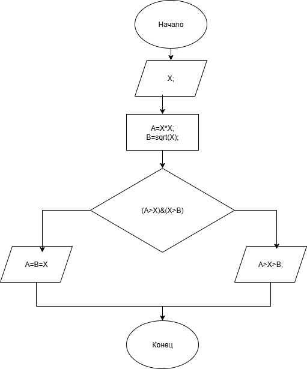

# homework-6-Lab

### Условие задачи

!

### Алгоритм
1. **Начало**
2. Задать исходные данные:
   - `X` - число для дальнейших преобразований.
3. Вычисление нужных значений:
   `A = X * X` - квадрат заданного числа.
   `B = sqrt(X)` - квадратный корень заданного числа.
4. Условие:
   `(A>X)&(X>B)`
5. Если условие верно - вывести:
   `A>X>B`
   Если условие ложно - вывести:
   `A=B=X`
6. **Конец**

### Блок-схема
!

(https://app.diagrams.net/?tags=%7B%7D&lightbox=1&highlight=0000ff&edit=_blank&layers=1&nav=1&title=%D0%94%D0%B8%D0%B0%D0%B3%D1%80%D0%B0%D0%BC%D0%BC%D0%B0%20%D0%B1%D0%B5%D0%B7%20%D0%BD%D0%B0%D0%B7%D0%B2%D0%B0%D0%BD%D0%B8%D1%8F.png&dark=auto#R%3Cmxfile%3E%3Cdiagram%20name%3D%22%D0%A1%D1%82%D1%80%D0%B0%D0%BD%D0%B8%D1%86%D0%B0%20%E2%80%94%201%22%20id%3D%22vKg7L8X21BIwSFlcxruJ%22%3E7Vpbb5swFP41SN2kVNwhj7l07TRN6hatS58qFlxAApw5zqX79bNjmxhMStqGXKq%2BOD7HN853PvscW9GsQba6RsE0%2Fg5DkGqmHq40a6iZpmN4pKSKJ6bo%2BgZTRCgJmUpSjJJ%2FgCt1rp0nIZiVOmIIU5xMy8oJzHMwwSVdgBBclrs9wrS86jSIgKIYTYJU1f5OQhwzrW96G%2F0NSKJYrGy4XdaSBaIzt2QWByFcSirrSrMGCELMatlqAFKKncCFjfuypbX4MARyvMuAwY3z7Zd399Dxvz483OEkjqHVMdksiyCdc4O1oa51h7Ts69rQ0HxP1EnZX5dX3CD8JFAiKxGHEKG%2FjBMMRtNgQluWhBJEF%2BMsJZJBqupHczsWAGGwklTciGsAM4DRE%2BnCW82uzYZwRjkc3%2BXGPYbAPJZc43NdwBkRFTNvQCMVjls9hqNe2HlMeyOv8zMa38cw%2FuGlNRiOC0sljIj%2Fp7RKjA%2FSFKQwQkFGOk4BSsiHAFRtu900NMH6mKyA2DwtwWzsirPbFs62gnOP%2FIw%2FM7TdlKzfD5MFqUa02ieNs78IX4w%2FSR3IylIfxUkIzvMQ0K%2FQD0NmwUqOsmkfG2VHQfmiR%2BAKMmr8GjSCp5BZeTEud%2Bh%2FUnGNYfZnPjsMpmYZU8tSMS1wljE17LZA9WqoW8a0guA7OEBst%2ByGQj4atf3aA4SeE%2BNzB9s7Nay79YlFjycQtGRJhrNOMtzjphSVU9jx7SPnFCL9lfFTEMrDHs1wiTRJg9ksmZSBKccysErwmNYvHS7d8360PlxJ3YZPQsiJLdIgKt7LbZtha0mM2%2BqSGZyjCWjOR3GAIoCbcy4QlrJ31cGSA50a%2FwkdAmmAk0U5569zKl%2FhFibEsoI%2FVjXieBVeMLv5KDlHr05U2cfFxGIiBowy0ZpjhdlvoJ3YOi3QzvItiXj6ZdfxWiEfnUQ6jHcn5HNEaySk%2FUHIVghZc0F9Z%2Bfgc3RqpJ3zQbtWaGe9iHY5zMEunDNKB6DzLOdez513ygnHquS4%2BoE5ob4%2F7IMT%2BgcnXs%2BJ4sZ%2BLE6oryVvDU9SqGEJUxFsLg3Xa8p9qLRz8tMYXfyTYk2js88muriHZI3uuYdljXdSrGkMG2fDGvUR8S3xZ6t%2FT8RvRsVvTvWpaue8wWyYqG2%2Fqc%2BOe9zte7mONG7p7klRw7L3RI2jb%2BmaV9J9pJQvuNpu5URjSnlaycH%2BUsqmc6dlTgg7zpITpxX693f1bC2EEHHzDxDWffM3GuvqPw%3D%3D%3C%2Fdiagram%3E%3C%2Fmxfile%3E)

### 2. Реализация программы

    #include <stdio.h>

    #include <locale.h>
    
    #include <math.h>
    
    #define _USE_MATH_DEFINES 

    int main()
    
    {
    
	    setlocale(LC_CTYPE, "");
      
	    int X;
      
	    puts("Введите значение X: ");
      
	    scanf("%d", &X);
      
	    int A, B;
      
	    A = X * X;
      
	    B = sqrt(X);
      
	    if ((A > X) & (X > B)) {
      
		    printf("%d>%d>%d\n", A, X, B);
        
	    }
      
	    else {
      
		    printf("%d=%d=%d, число равно в любом преобразовании",A,B,X);
        
	    }

	    return 0;
      
    }

### 3. Результаты работы программы

    Введите значение X:

    144

    20736>144>12

### 4. Информация о разработчике

Гусев Иван бИЦ-251
